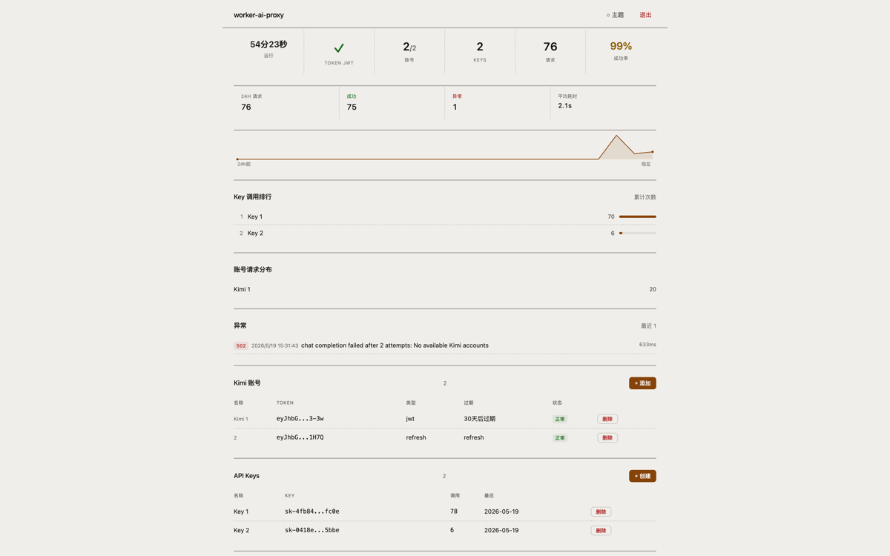

<h1 align="center">cf-kimi-api-ts</h1>

<p align="center">
  <strong>Kimi Web → OpenAI 兼容 API 网关</strong>
  <br>
  基于 Cloudflare Workers，将 Kimi Web 的专有协议转换为 OpenAI 兼容的 <code>/v1/*</code> 接口
</p>

<p align="center">
  
  
  
  
</p>

---

## 📸 管理面板



---

## ✨ 功能

- **OpenAI 兼容接口** — `GET /v1/models`、`POST /v1/chat/completions`、`POST /v1/completions`、`POST /v1/responses`
- **流式与非流式** — SSE streaming 与完整非流式响应
- **Kimi 账号池** — 多账号健康调度、Token 自动刷新、并发控制、冷却策略
- **API Key 管理** — 创建、删除、请求计数
- **请求日志** — 筛选、详情、错误追踪
- **管理面板** — 单文件 SPA，深色极简设计，零外部依赖
- **Cloudflare Workers 原生** — KV + D1 存储，全球部署

---

## 🚀 部署

### 方式一：Git 集成部署（无需 CLI）

全程点击，不碰代码。

**① Fork**

点击右上角 **Fork**。

**② 创建 Worker 并连接 GitHub**

Cloudflare Dashboard → **Workers & Pages** → **创建应用程序** → **连接 GitHub 仓库** → 授权 GitHub → 选择 fork 的 `cf-kimi-api-ts`。

| 字段 | 填写 |
|------|------|
| 项目名称 | `cf-kimi-api-ts` |
| 生产分支 | `main` |
| 框架预设、构建命令、部署命令 | 全部留空 |

→ **保存并部署**（首次部署无 KV/D1 绑定，但能成功）。

**③ 创建 KV**

Dashboard → **Workers & Pages** → **KV** → 创建命名空间，名称随意（如 `CF_KIMI_API`）。

**④ 创建 D1**

Dashboard → **Workers & Pages** → **D1** → 创建数据库，名称 `cf-kimi-api-logs`。

**⑤ 绑定 KV + D1**

Worker `cf-kimi-api-ts` → **设置 → 绑定** → 添加：

| 变量名 | 类型 | 选择 |
|--------|------|------|
| `KV` | KV Namespace | ③ 创建的 KV |
| `DB` | D1 Database | ④ 创建的 D1 |

**⑥ 添加环境变量**

Worker `cf-kimi-api-ts` → **设置 → 变量** → 添加（添加后自动重新部署）：

| 变量名 | 值 |
|--------|-----|
| `ADMIN_PASSWORD` | 你的管理密码 |
| `SESSION_SECRET` | 随便一个字符串，如 `my-secret` |

> 其他变量（`KIMI_API_BASE`、`TIMEZONE` 等）代码中已有默认值，无需添加。

**⑦ 访问**

`https://cf-kimi-api-ts.你的子域名.workers.dev/admin` → 用 `ADMIN_PASSWORD` 登录 → 添加 Kimi Token → 创建 API Key → 开始调用。

> 之后每次向 `main` 推送代码，Cloudflare 自动重新部署。

---

### 方式二：Wrangler CLI 部署

适合开发者，命令行完成全部操作。

```bash
# Fork → Clone
git clone https://github.com/你的用户名/cf-kimi-api-ts.git
cd cf-kimi-api-ts
npm install

# 登录 Cloudflare
npx wrangler login

# 创建 KV 和 D1（记下返回的 ID）
npx wrangler kv namespace create "CF_KIMI_API"
npx wrangler d1 create cf-kimi-api-logs

# 编辑 wrangler.toml，填入上面的 ID
# 设置 Secrets
echo "你的管理密码" | npx wrangler secret put ADMIN_PASSWORD
openssl rand -base64 32 | npx wrangler secret put SESSION_SECRET

# 部署
npm run deploy
```

**可选：绑定自定义域名**

有域名托管在 Cloudflare 的话，可以绑定绕过代理限制：

```bash
npx wrangler triggers deploy --name "cf-kimi-api-ts" --route "你的域名/*"
```

然后在 Cloudflare Dashboard 添加 DNS A 记录（开启代理/橙云）指向 `192.0.2.1`。

**首次使用**

访问 `https://你的域名/admin` → 用 `ADMIN_PASSWORD` 登录 → 添加 Kimi Token → 创建 API Key → 开始调用。

---

## 📖 API

### 公开接口

| 方法 | 路径 | 说明 |
|------|------|------|
| `GET` | `/healthz` | 健康检查 |
| `GET` | `/admin` | 管理面板 SPA |

### OpenAI 兼容接口

| 方法 | 路径 | 说明 |
|------|------|------|
| `GET` | `/v1/models` | 模型列表 |
| `GET` | `/v1/models/{id}` | 模型详情 |
| `POST` | `/v1/chat/completions` | Chat Completions |
| `POST` | `/v1/completions` | Legacy Completions |
| `POST` | `/v1/responses` | Responses API |

所有 `/v1/*` 接口需携带 API Key：`Authorization: Bearer <你的_API_Key>`。

### 管理面板

| 模块 | 说明 |
|------|------|
| **概览** | 运行状态、Token 健康、账号统计、Key 数量、24h 请求趋势 |
| **账号** | Kimi 账号池管理：添加/删除、Token 类型检测、状态监控 |
| **Keys** | API Key 管理：创建、复制、删除、调用次数统计 |
| **日志** | 请求日志：按状态筛选、分页、查看详情 |

---

## ⚙️ 配置

### 存储绑定

| 绑定 | 类型 | 用途 |
|------|------|------|
| `KV` | KV Namespace | 存储账号、Key、Token 缓存等持久数据 |
| `DB` | D1 Database | 存储请求日志 |

> Dashboard → Worker → **设置 → 绑定** 中添加。

### 环境变量

| 变量 | 必填 | 说明 |
|------|------|------|
| `ADMIN_PASSWORD` | ✅ | 管理面板登录密码 |
| `SESSION_SECRET` | ✅ | JWT 签名密钥，任意字符串即可 |

其余变量（`KIMI_API_BASE`、`TIMEZONE`、`REQUEST_LOG_RETENTION`、`DEFAULT_MODEL`）代码中已有默认值，**无需设置**。

---

## 🏗️ 项目结构

```
src/
├── index.ts               # Hono 应用入口
├── config.ts              # 环境变量配置
├── admin-html.ts          # 管理面板 SPA（HTML 内联）
├── api/                   # OpenAI 兼容 API
│   ├── auth.ts            #   API Key 验证中间件
│   ├── routes.ts          #   /v1/* 路由处理
│   ├── models.ts          #   模型解析
│   ├── streaming.ts       #   流式响应
│   └── errors.ts          #   错误响应
├── kimi/                  # Kimi Web 协议客户端
│   ├── client.ts          #   Kimi2API 主类
│   ├── protocol.ts        #   协议定义、消息格式化
│   ├── transport.ts       #   请求传输与重试
│   ├── chunks.ts          #   Streaming chunk 构造
│   ├── events.ts          #   gRPC 事件解析
│   └── model-catalog.ts   #   模型目录
├── dashboard/             # 管理面板 API
│   └── routes.ts          #   所有 /admin/api/* 路由
├── services/              # 核心服务
│   ├── account-pool.ts    #   账号池调度
│   ├── token-manager.ts   #   Token 刷新与缓存
│   └── session.ts         #   管理面板会话
├── stores/                # KV/D1 存储层
│   ├── accounts.ts        #   Kimi 账号
│   ├── keys.ts            #   API Key
│   ├── logs.ts            #   请求日志 (D1)
│   ├── tokens.ts          #   Token 缓存
│   ├── conversations.ts   #   对话上下文
│   ├── identity.ts        #   客户端设备标识
│   └── catalog.ts         #   模型目录缓存
└── utils/
    ├── crypto.ts          #   加密工具
    └── time.ts            #   时间工具
static/
  └── admin.html           # 管理面板 SPA（独立 HTML）
```

---

## 🔒 安全

- 设置强 `ADMIN_PASSWORD`，不要与其他服务共用
- 不要把真实 Token、API Key 提交到仓库
- 本地配置覆盖用 `wrangler.toml.local`（已 `.gitignore`），避免误提交真实 ID

---

## 📝 更新日志

详见 [CHANGELOG.md](./CHANGELOG.md)

## 🤝 贡献

欢迎贡献！请阅读 [CONTRIBUTING.md](./CONTRIBUTING.md)

## 🙏 致谢

感谢原项目 [XxxXTeam/kimi2api](https://github.com/XxxXTeam/kimi2api) 的基础实现和思路。

## 📄 许可证

[MIT License](./LICENSE) © 2026 chopper1026
